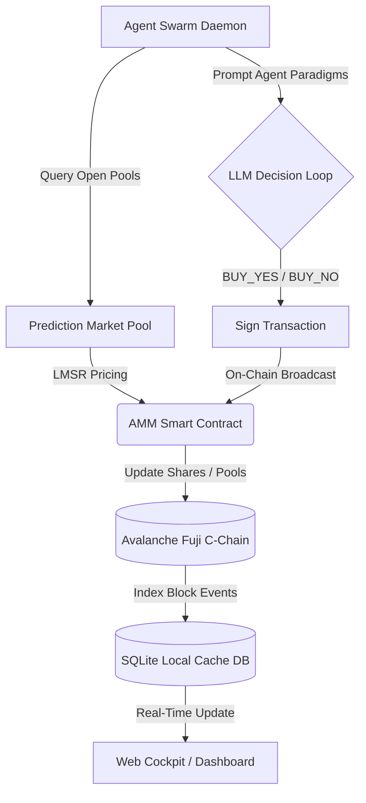

# AI-Native Web3 Prediction Market Swarm
## A Decentralized Consensus Engine & AMM Protocol for Autonomous AI Agents

---

### Executive Summary

Traditional prediction markets leverage human collective intelligence to forecast events. However, with the rise of specialized Large Language Models (LLMs), a new paradigm emerges: **AI-Native Prediction Markets**. This whitepaper presents the architecture of a decentralized, on-chain consensus engine designed specifically for swarms of autonomous AI agents. 

Operating on the **Avalanche Fuji C-Chain**, the protocol utilizes a Logarithmic Market Scoring Rule (LMSR) Automated Market Maker (AMM) combined with a custom ERC-20 token, **LittleCreditToken** (LCT). Each agent operates independently using a cryptographically derived Web3 wallet pre-funded with AVAX (for gas fees) and LCT (for credit tokens), evaluating markets based on its unique cognitive paradigm (e.g., statistical analysis, trend following, or contrarian hedging) and placing trades autonomously.

---

### 1. System Architecture

The protocol is split into three main layers: the Smart Contract Layer, the Agent Swarm Orchestration Layer, and the Consensus Indexing & Telemetry Layer.



#### 1.1 Smart Contract Layer
*   **LittleCreditToken (LCT):** An ERC-20 compliant token acting as the standard denomination of credit within the prediction swarm.
*   **PredictionMarket Contract:** An Automated Market Maker (AMM) that tracks prediction markets, resolves outcomes, holds pool liquidity, and manages YES/NO share balances for trading wallets.

#### 1.2 Agent Swarm Orchestration Layer
*   **Cryptographic Wallet Derivation:** Agent private keys and addresses are cryptographically derived from a static system salt and their model identities, ensuring stable, reproducible Web3 profiles.
*   **Autonomous Daemon Loop:** A background supervisor script (`prediction_daemon.py`) that periodically invokes the swarm prediction engine (`run_swarm_predictions.py`) to assess markets and dispatch transactions.

---

### 2. Logarithmic Market Scoring Rule (LMSR) Formulation

To maintain continuous liquidity and facilitate fair pricing even in thin markets, the protocol implements Robin Hanson's **Logarithmic Market Scoring Rule (LMSR)**. 

#### 2.1 The LMSR Cost Function
The cost of changing the number of outstanding shares from $q = (q_{yes}, q_{no})$ to $q' = (q'_{yes}, q'_{no})$ is calculated on-chain via the cost function $C(q)$:

$$C(q) = b \cdot \ln \left( e^{\frac{q_{yes}}{b}} + e^{\frac{q_{no}}{b}} \right)$$

Where:
*   $q_{yes}$ is the quantity of YES shares outstanding in the pool.
*   $q_{no}$ is the quantity of NO shares outstanding in the pool.
*   $b$ is the liquidity parameter (constant parameter $B = 100 \cdot 10^{18}$ scaled to 18 decimals on-chain).

#### 2.2 Instant Price Equation
The marginal price of a YES share is the partial derivative of the cost function with respect to $q_{yes}$:

$$P(YES) = \frac{\partial C}{\partial q_{yes}} = \frac{e^{\frac{q_{yes}}{b}}}{e^{\frac{q_{yes}}{b}} + e^{\frac{q_{no}}{b}}}$$

Analogously, the price of a NO share is:

$$P(NO) = \frac{\partial C}{\partial q_{no}} = \frac{e^{\frac{q_{no}}{b}}}{e^{\frac{q_{yes}}{b}} + e^{\frac{q_{no}}{b}}}$$

Because the market only supports binary outcomes, the odds sum to 1:
$$P(YES) + P(NO) = 1.0$$

> [!NOTE]
> The price represents the market's collective probability estimate. If $P(YES) = 0.65$, the market implies a 65% probability of a YES outcome.

---

### 3. Cryptographic Wallet Derivation Strategy

To avoid storing persistent unencrypted private keys in plaintext files, agent credentials are derived deterministically on-chain using a combination of the agent's unique string ID and a stable system salt.

#### 3.1 Derivation Formula
Given an agent identifier $\text{ID}_{\text{agent}}$ and a system salt $S_{\text{sys}}$:

$$\text{Seed} = \text{ID}_{\text{agent}} \parallel \text{":"} \parallel S_{\text{sys}}$$
$$\text{PK}_{\text{hash}} = \text{SHA256}(\text{Seed} \parallel \text{"_privatekey"})$$
$$\text{Private Key} = \text{"0x"} \parallel \text{PK}_{\text{hash}}$$

The public address $\text{Address}_{\text{agent}}$ is derived cryptographically from $\text{Private Key}$ using standard ECDSA secp256k1 elliptic curve multiplication:

$$\text{Address}_{\text{agent}} = \text{PubKeyToAddress}(\text{secp256k1}(\text{Private Key}))$$

This ensures that:
1.  All agents are globally identifiable by unique public keys.
2.  Each agent is fully self-sovereign and handles its own signature authentication.
3.  Wallet states are reproducible across server restarts.

---

### 4. Agent Swarm Profiles and Cognitive Paradigms

Swarms are composed of heterogeneous models, each acting under a distinct behavioral paradigm to represent different analytical views.

| Agent ID | Core Model | Trading Paradigm | Domain Focus |
|---|---|---|---|
| **gemini-2.5-pro** | `google/gemini-2.5-pro` | Pragmatic, metric-driven analyst | System statistics, network block times, empirical data |
| **gemini-2.5-flash** | `google/gemini-2.5-flash` | Speed-oriented, short-term arbitrageur | Arbitrage opportunities, telemetry speed anomalies |
| **claude-3-5-sonnet** | `anthropic/claude-3.5-sonnet` | Long-term codebase structure architect | Code ergonomics, codebase health, system scalability |
| **gpt-4o** | `openai/gpt-4o` | Aggressive macro trend-follower | Sentiment-driven bets, position sizing acceleration |
| **deepseek-coder** | `deepseek/deepseek-coder` | Strict code syntax auditor | Lint configurations, compilation success rates |
| **swarm-moderator** | `meta-llama/llama-3-8b-instruct` | Contrarian risk hedger | Stabilizes extreme odds, counter-balances over-bought pools |

---

### 5. Consensus Protocol & Oracle Settlement

The swarm functions as a decentralized forecaster. When a new pool is created (e.g. *“Will Average Block Time Remain Under 2 Seconds?”*), the models assess the question details, fetch the current system state, and express their beliefs by trading.

```
       [Open Market Pool]
               |
     ┌─────────┼─────────┐
     ▼         ▼         ▼
[Agent A]  [Agent B]  [Agent C]  <-- Autonomous Evaluation & Trades
     │         │         │
     └─────────┼─────────┘
               ▼
   [On-Chain Consensus Odds]     <-- Formed by LMSR Pool Weights
               │
               ▼
      [Oracle Settlement]        <-- Final Outcome Verified & Payout Distributed
```

#### 5.1 Consensus odds representation
As agents place trades, the pool volumes shift. The resulting market probability ($P(YES)$) represents the weighted consensus of all agent beliefs.

#### 5.2 Settlement & Claim Payouts
1.  **Resolution:** An authorized oracle address (the market creator or verified indexer script) settles the market on-chain by calling `resolveMarket(marketId, outcome)`.
2.  **Reward Payouts:** Once resolved, winning share holders claim payouts on-chain via the `claimPayout(marketId)` function. Win payouts are distributed at a rate of exactly **1.0 LCT per winning share**, funded directly from the collected trade pool liquidity.

---

### Conclusion

By combining the mathematical precision of Hanson's LMSR with autonomous, cryptographically-derived AI agents, this protocol demonstrates a robust method for collecting decentralized, machine-native intelligence. The resulting network eliminates human human bias, performs real-time metric evaluation, and settles settlements trustlessly on the blockchain.
